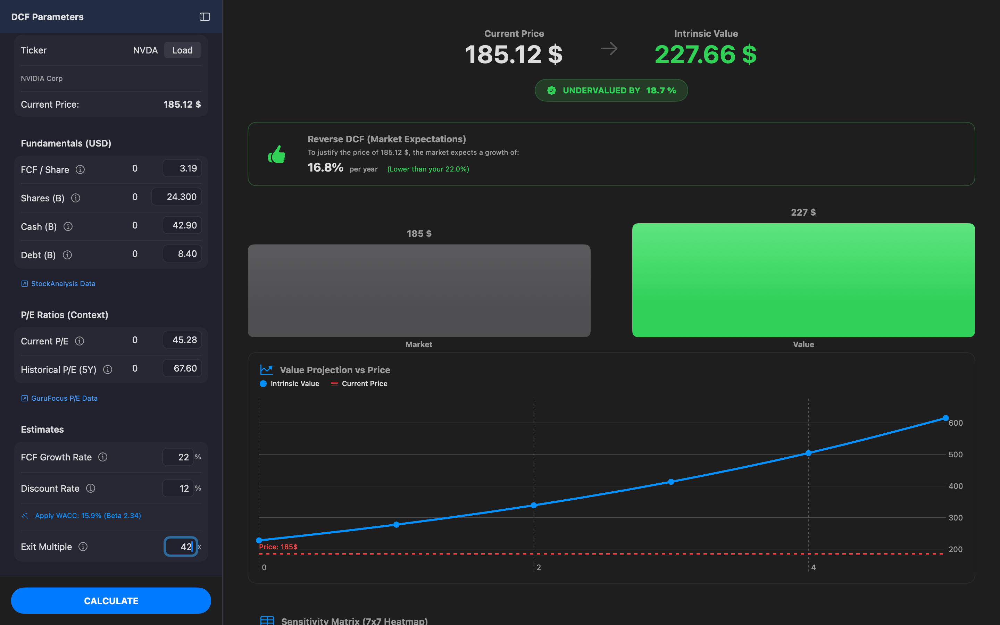
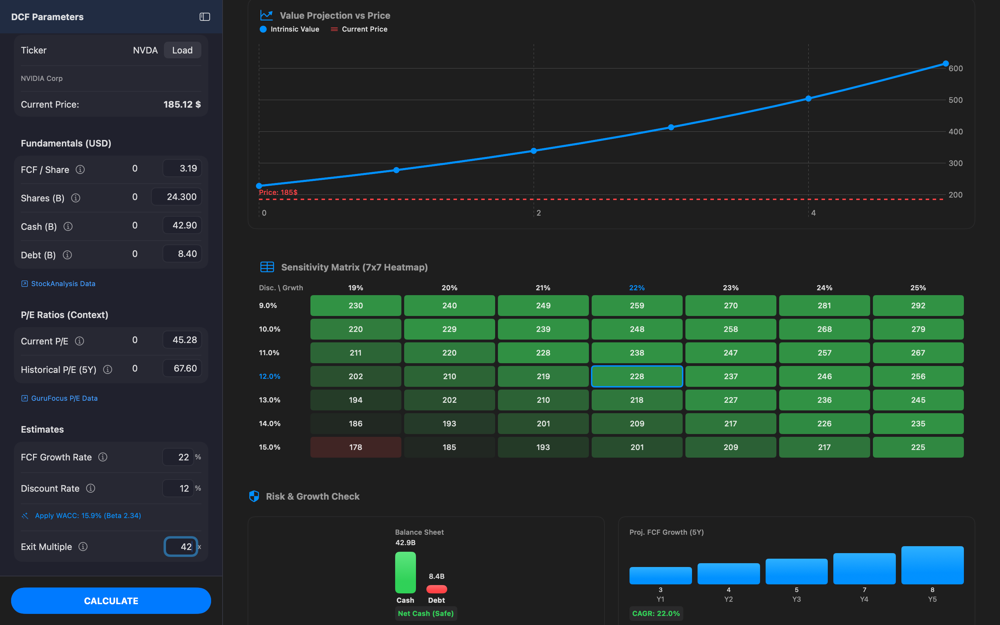
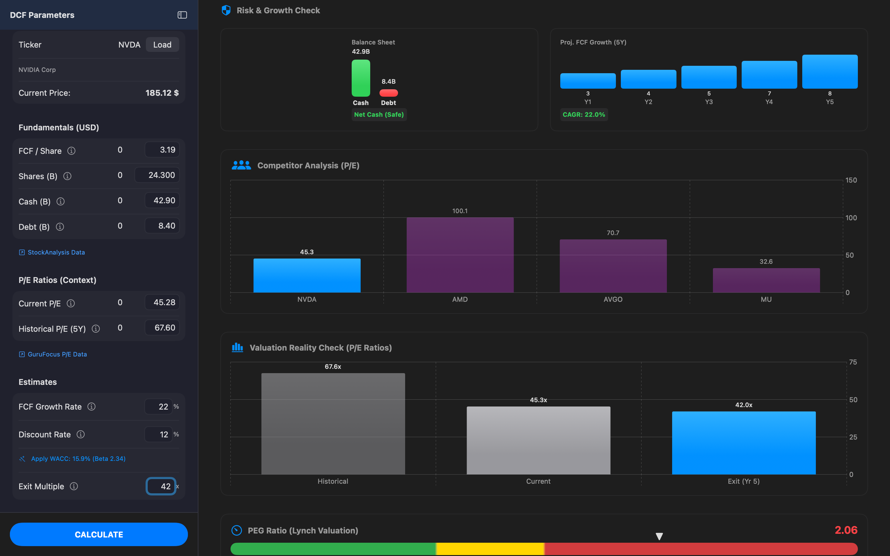
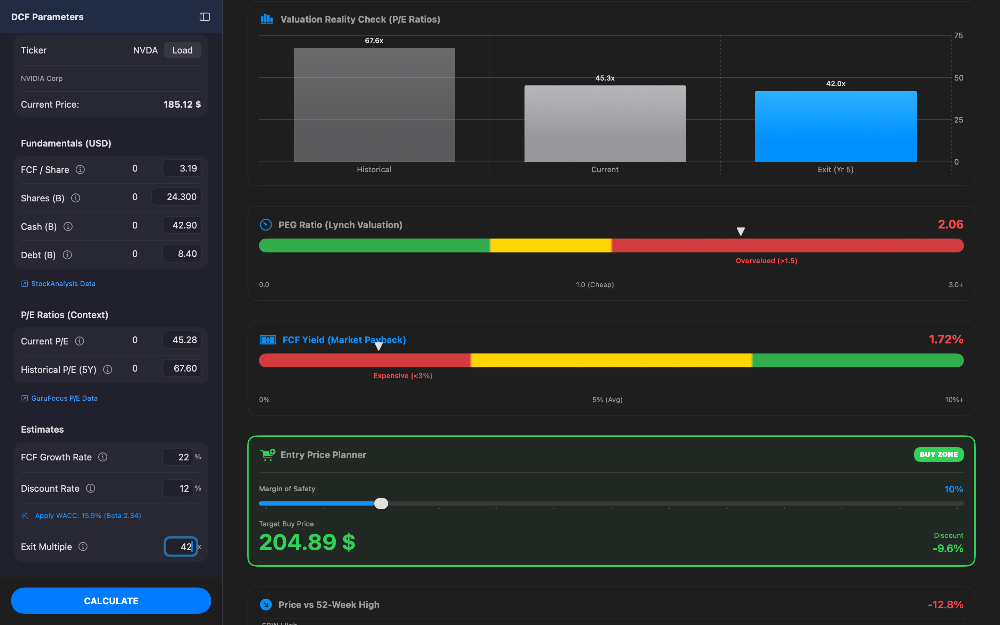
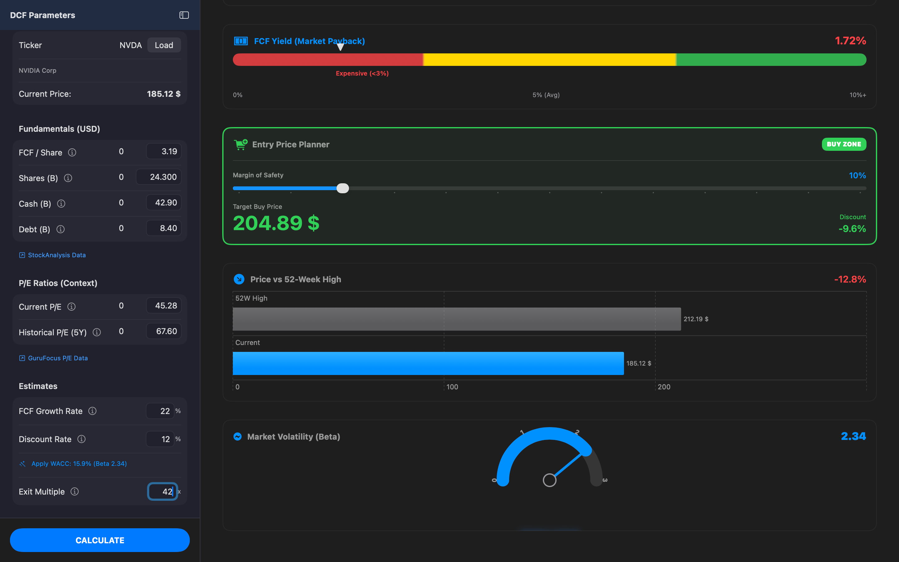

> *"Price is what you pay. Value is what you get."* — Warren Buffett

# Intrinsic 📈

> **Invest with institutional precision.**
> The professional stock valuation tool built for macOS.

**Intrinsic** replaces complex, error-prone spreadsheets with a clean, native macOS interface. It automates financial data retrieval and performs advanced valuation models (DCF, Reverse DCF, Lynch Ratios) in seconds, not minutes.

---

## 📸 Screenshots

  
  
  
  
  

---

## ⚠️ Disclaimer

This software is for educational and informational purposes only. It does not constitute financial advice. Stock valuation involves assumptions that may not materialize. Always do your own due diligence.

---

## ✨ Key Features (v2.0)

### 🧠 Automated Intelligence
* **Zero-Entry Valuation:** Powered by the **Finnhub API**. Automatically fetches FCF, Cash, Debt, and Shares data. Just type a ticker (e.g., NVDA, AZN.L).
* **Automated DCF:** Instantly projects intrinsic value over 5 years based on live fundamentals.
* **Magic WACC:** automatically calculates the Discount Rate based on the stock's real-time **Beta** and Risk-Free rates.
* **Reverse DCF:** "Sanity check" the market. Calculates the growth rate implied by the current stock price.

### 📊 Professional Visualizations
* **Analyst Consensus Trend:** Interactive stacked bar chart visualizing "Strong Buy" to "Sell" recommendations over time.
* **Competitor Analysis:** Automatically compares your stock's P/E ratio against its top 3 direct industry peers.
* **Exotic Beta Gauge:** Visual risk assessment meter (Low Volatility vs. Speculative).
* **Price Context:** Visualizes the current price relative to its **52-Week High**.

### 🛡️ Risk Management
* **Sensitivity Matrix:** An interactive 7x7 Heatmap to stress-test valuations against different Discount Rates and Growth assumptions.
* **Lynch Valuation:** PEG Ratio analysis to contextualize high P/E multiples against growth.
* **Financial Health Check:** Visual balance sheet analysis (Net Cash vs. Total Debt).
* **Dynamic Margin of Safety:** Slider-based entry price planning with immediate visual feedback ("Buy Zone").

### 💎 UX & Technical Highlights
* **Modern Glassmorphism UI:** A completely redesigned, sleek interface that feels native to macOS.
* **Interactive Charts:** Hover over any data point (Analysts, Peers, Projections) for precise tooltips.
* **Built-in Education:** Integrated "?" help system explaining DCF concepts for beginners.
* **Privacy First:** All calculations are performed locally on-device.

---

## 🛠️ Installation

### Option 1: Download the App
You can download the latest signed `.dmg` version from my Official Website:
👉 **[Download Intrinsic for Mac](https://arthvrr.github.io/Intrinsic/)**

--- 

## 📄 License

Distributed under the MIT License.

Copyright (c) 2026 Arthvrr

Permission is hereby granted, free of charge, to any person obtaining a copy of this software and associated documentation files (the "Software"), to deal in the Software without restriction, including without limitation the rights to use, copy, modify, merge, publish, distribute, sublicense, and/or sell copies of the Software, and to permit persons to whom the Software is furnished to do so, subject to the following conditions:

The above copyright notice and this permission notice shall be included in all copies or substantial portions of the Software.

THE SOFTWARE IS PROVIDED "AS IS", WITHOUT WARRANTY OF ANY KIND, EXPRESS OR IMPLIED, INCLUDING BUT NOT LIMITED TO THE WARRANTIES OF MERCHANTABILITY, FITNESS FOR A PARTICULAR PURPOSE AND NONINFRINGEMENT. IN NO EVENT SHALL THE AUTHORS OR COPYRIGHT HOLDERS BE LIABLE FOR ANY CLAIM, DAMAGES OR OTHER LIABILITY, WHETHER IN AN ACTION OF CONTRACT, TORT OR OTHERWISE, ARISING FROM, OUT OF OR IN CONNECTION WITH THE SOFTWARE OR THE USE OR OTHER DEALINGS IN THE SOFTWARE.